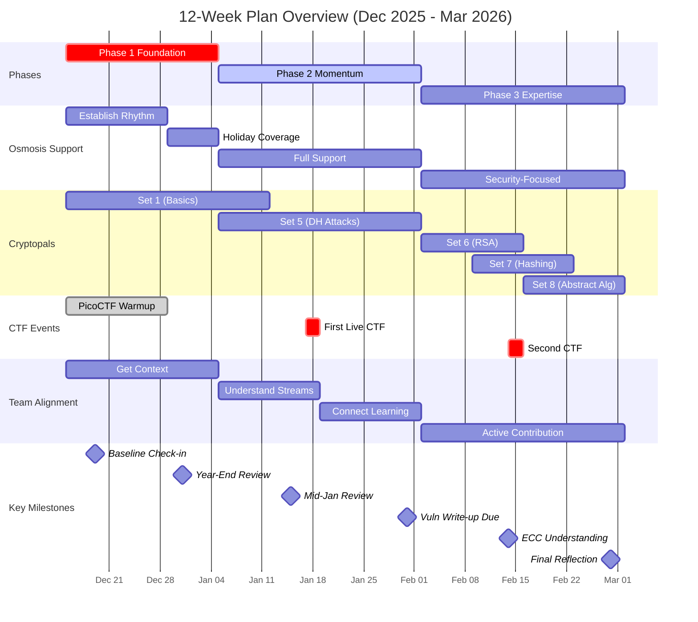

# 12-Week Upskilling & Work Plan (Mid-December 2025 - End of February 2026)

## Overview
This plan balances your Osmosis responsibilities (~20 hours/week) with cryptography upskilling (~18 hours/week), team alignment work (~2 hours/week), and vibe coding time (~8 hours/weekend) while maintaining sustainable work-life balance. The structure accounts for holiday time off and gradually builds your security auditing capabilities while ensuring you stay connected to team direction.

---

## 📊 Visual Timeline

### 12-Week Summary Overview

---

## Final Notes

This plan gives you a sustainable 40-hour weekday structure with meaningful progress on Osmosis support, crypto upskilling, AND team alignment, while preserving 8 hours of pure creative fun time on weekends. The 2 hours/week for team alignment ensures you're building context gradually without feeling overwhelmed, so by February you can participate meaningfully in team discussions and understand how your security work fits into the bigger picture.

Remember: This is a guide, not a rigid contract. Adjust as you learn what works best. The goal is steady progress toward becoming a valuable security contributor while staying healthy, engaged, and connected to your team.

